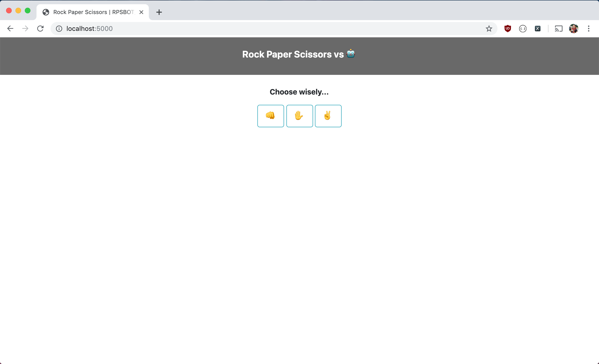
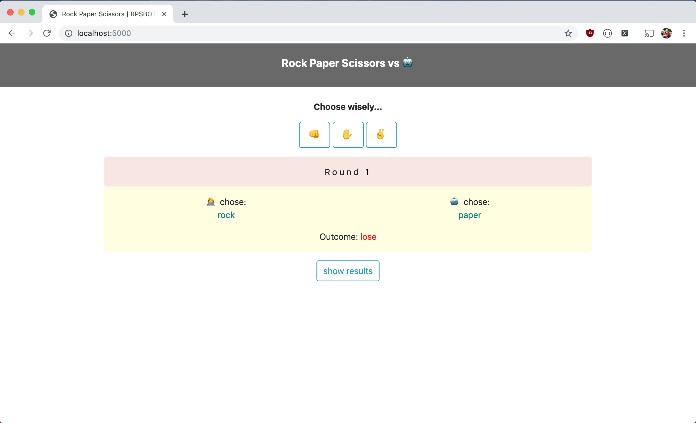
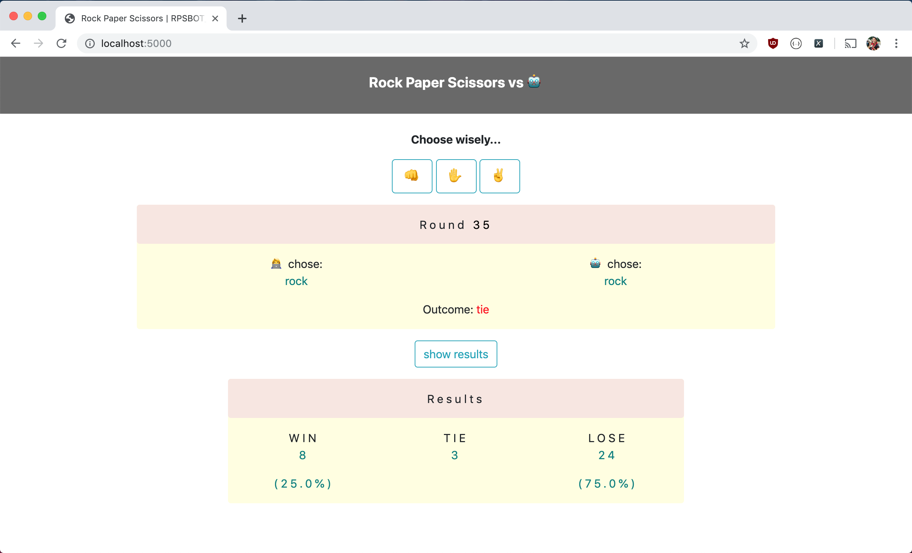

# rps_bot
> Rock Paper Scissor game app against a clever bot based on markov chains

**rps_bot** is a Flask-powered web game application which allows users to play against a robot trained using markov chains. It takes input from a user's choice (rock, paper, or scissor) and returns the robot's choice (without peeking into the future at the user's choice for that particular round).

## Screenshots

<b>Start of game:</b> 

<b>End of Round 1:</b> 

<b>End of Round 35:</b> 

## Future Work
- Publish the game app online
- Collect and keep historical data on how human's play the game
- Improve the markov chain model
- (nice to have) Improve UX/UI of the application

*Rock, paper, scissors, lizard, Spock.*
